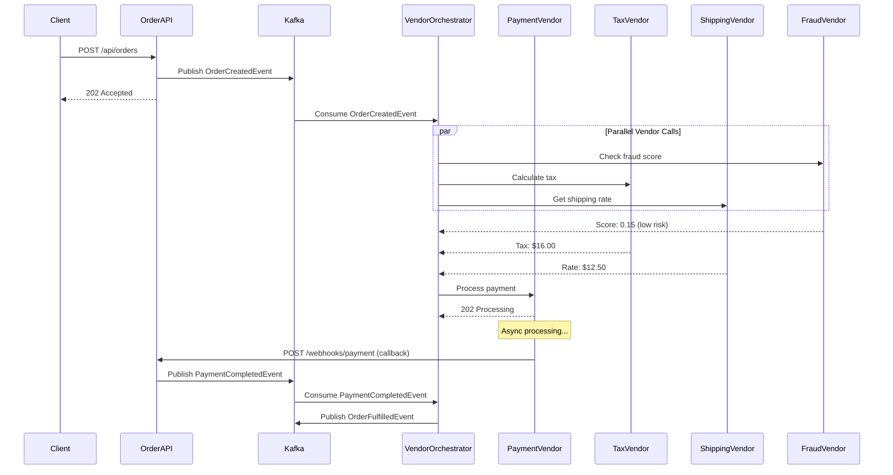

# Vendor Data Processing System 🚀

A production-ready **Spring Boot** system demonstrating **external vendor integration** with **real-time data processing** using **Apache Kafka**.

## 🎯 Project Purpose

This project showcases how to integrate with **multiple external vendors** (Payment, Shipping, Tax, Fraud Detection) in a **scalable, fault-tolerant** architecture using:

- ✅ **Event-Driven Architecture** with Kafka
- ✅ **Webhook Handling** for async vendor responses
- ✅ **Circuit Breaker & Retry** patterns (Resilience4j)
- ✅ **Vendor Abstraction** for easy vendor swapping
- ✅ **Real-time Data Streaming**
- ✅ **Comprehensive Observability**

---

## 🏗️ Architecture


### High-Level Flow

```
Order API → Kafka → Vendor Orchestrator → External Vendors (HTTP)
                                              ↓
                                          Webhooks
                                              ↓
                                          Kafka Events
                                              ↓
                                     Downstream Services
```

### **Vendors Integrated**

| Vendor Type | Purpose | Integration Method |
|-------------|---------|-------------------|
| **Payment Vendor** | Process payments | REST API + Webhooks |
| **Shipping Vendor** | Calculate shipping rates | REST API (sync) |
| **Tax Vendor** | Calculate sales tax | REST API (sync) |
| **Fraud Detection** | Risk scoring | REST API + Async callback |

---

## 🚀 Quick Start

### Prerequisites
- Java 17+
- Maven 3.8+
- Docker & Docker Compose
- Kafka (via Docker)

### 1. Start Infrastructure

```bash
docker-compose up -d
```

This starts:
- Kafka (port 19092)
- Zookeeper (port 2181)
- PostgreSQL (port 5432)
- Mock Vendor APIs (port 9000)

### 2. Run Application

```bash
mvn spring-boot:run
```

### 3. Test End-to-End Flow

```bash
# Create an order (triggers all vendors)
curl -X POST http://localhost:8080/api/orders \
  -H "Content-Type: application/json" \
  -d '{
    "customerId": "CUST-001",
    "productId": "PROD-123",
    "quantity": 2,
    "amount": 199.99,
    "shippingAddress": {
      "street": "123 Main St",
      "city": "New York",
      "state": "NY",
      "zipCode": "10001"
    }
  }'
```

---

## 📊 Data Flow

### **Order Processing Flow**



---

## 🔧 Configuration

### **application.yml**

```yaml
spring:
  application:
    name: vendor-data-processing
  
  kafka:
    bootstrap-servers: localhost:19092
    consumer:
      group-id: vendor-processing-group
      auto-offset-reset: earliest
    producer:
      key-serializer: org.apache.kafka.common.serialization.StringSerializer
      value-serializer: org.springframework.kafka.support.serializer.JsonSerializer

# Vendor API Endpoints
vendors:
  payment:
    base-url: http://localhost:9000/payment-api
    api-key: ${PAYMENT_VENDOR_API_KEY:test-key-123}
    timeout: 5000
  
  shipping:
    base-url: http://localhost:9000/shipping-api
    api-key: ${SHIPPING_VENDOR_API_KEY:ship-key-456}
    timeout: 3000
  
  tax:
    base-url: http://localhost:9000/tax-api
    api-key: ${TAX_VENDOR_API_KEY:tax-key-789}
    timeout: 2000
  
  fraud:
    base-url: http://localhost:9000/fraud-api
    api-key: ${FRAUD_VENDOR_API_KEY:fraud-key-000}
    timeout: 4000

# Resilience4j Configuration
resilience4j:
  circuitbreaker:
    instances:
      paymentVendor:
        slidingWindowSize: 10
        failureRateThreshold: 50
        waitDurationInOpenState: 10s
        permittedNumberOfCallsInHalfOpenState: 3
      
      shippingVendor:
        slidingWindowSize: 10
        failureRateThreshold: 50
        waitDurationInOpenState: 5s
  
  retry:
    instances:
      paymentVendor:
        maxAttempts: 3
        waitDuration: 1s
        exponentialBackoffMultiplier: 2
      
      shippingVendor:
        maxAttempts: 2
        waitDuration: 500ms
```

---

## 📡 API Endpoints

### **Order Management**

```bash
# Create Order
POST /api/orders

# Get Order Status
GET /api/orders/{orderId}

# Get Order History
GET /api/orders/customer/{customerId}
```

### **Webhooks (Vendor Callbacks)**

```bash
# Payment Vendor Webhook
POST /webhooks/payment

# Fraud Detection Webhook
POST /webhooks/fraud
```

### **Monitoring**

```bash
# Health Check
GET /actuator/health

# Metrics
GET /actuator/metrics

# Circuit Breaker Status
GET /actuator/circuitbreakers
```

---

## 🛡️ Fault Tolerance

### **Circuit Breaker Pattern**

Automatically opens circuit when vendor fails repeatedly:

```java
@CircuitBreaker(name = "paymentVendor", fallbackMethod = "fallbackPayment")
@Retry(name = "paymentVendor")
public PaymentResponse processPayment(PaymentRequest request) {
    return paymentVendorClient.charge(request);
}

public PaymentResponse fallbackPayment(PaymentRequest request, Exception e) {
    log.error("Payment vendor circuit open, queuing for retry");
    // Queue to Kafka for async retry
    kafkaProducer.publishPaymentRetry(request);
    return PaymentResponse.pending();
}
```

### **Retry Strategy**

- **Exponential Backoff**: 1s → 2s → 4s
- **Max Attempts**: 3
- **Jitter**: Randomized delay to prevent thundering herd

---

## 📊 Observability

### **Metrics (Prometheus)**

- Vendor API call duration
- Circuit breaker state
- Kafka consumer lag
- Success/failure rates

### **Logging**

Structured JSON logs with correlation IDs:

```json
{
  "timestamp": "2025-12-02T22:40:00Z",
  "level": "INFO",
  "service": "vendor-data-processing",
  "correlationId": "order-12345",
  "vendor": "payment",
  "action": "charge",
  "duration": 234,
  "status": "success"
}
```

---

## 🧪 Testing

### **Run Unit Tests**

```bash
mvn test
```

### **Run Integration Tests**

```bash
mvn verify
```

### **Test Vendor Failure Scenarios**

```bash
# Simulate payment vendor timeout
curl -X POST http://localhost:9000/admin/payment/simulate-timeout

# Simulate fraud vendor failure
curl -X POST http://localhost:9000/admin/fraud/simulate-error
```

---

## 🔑 Key Design Patterns

1. **Vendor Abstraction Layer**: Easy to swap vendors
2. **Event-Driven Architecture**: Loose coupling via Kafka
3. **Saga Pattern**: Distributed transaction handling
4. **Circuit Breaker**: Prevent cascading failures
5. **Webhook Handler**: Async vendor responses
6. **Idempotency**: Prevent duplicate processing

---

## 📚 Project Structure

```
src/main/java/com/enterprise/vendor/
├── controller/
│   ├── OrderController.java
│   └── WebhookController.java
├── service/
│   ├── OrderService.java
│   ├── VendorOrchestrator.java
│   └── vendor/
│       ├── PaymentVendorService.java
│       ├── ShippingVendorService.java
│       ├── TaxVendorService.java
│       └── FraudVendorService.java
├── kafka/
│   ├── producer/
│   │   └── OrderEventProducer.java
│   └── consumer/
│       └── OrderEventConsumer.java
├── client/
│   ├── PaymentVendorClient.java
│   ├── ShippingVendorClient.java
│   ├── TaxVendorClient.java
│   └── FraudVendorClient.java
├── model/
│   ├── Order.java
│   ├── VendorRequest.java
│   └── VendorResponse.java
└── config/
    ├── KafkaConfig.java
    ├── WebClientConfig.java
    └── ResilienceConfig.java
```

---

## 🎯 Use Cases

This project demonstrates:

- ✅ **Multi-Vendor Integration** in e-commerce
- ✅ **Real-time Data Processing** with Kafka
- ✅ **Fault-Tolerant Architecture** with circuit breakers
- ✅ **Webhook Handling** for async vendor responses
- ✅ **Scalable Microservices** design
- ✅ **Production-Ready** patterns

---

## 👨‍💻 Author

**Shivam Srivastav**

---

**Built with ❤️ using Spring Boot, Kafka, and Resilience4j**
